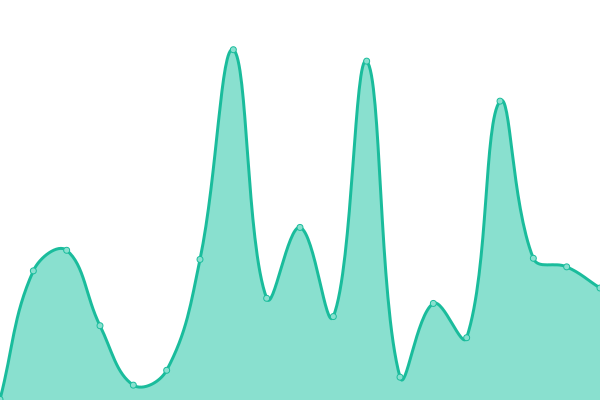
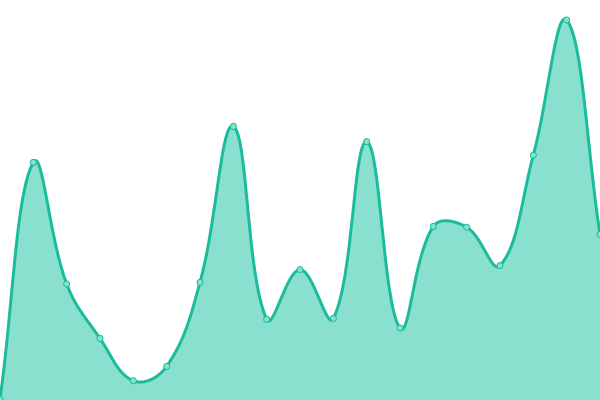

# 🏠 Shelter Access Status Monitor

This repository contains the open-source uptime monitor and status page for [NUR—Negev Urban Research](https://nurlab.org/), powered by [Upptime](https://github.com/upptime/upptime).

With [Upptime](https://upptime.js.org), you can get your own unlimited and free uptime monitor and status page, powered entirely by a GitHub repository. We use [Issues](https://github.com/NegevUrbanResearch/upptime/issues) as incident reports, [Actions](https://github.com/NegevUrbanResearch/upptime/actions) as uptime monitors, and [Pages](https://negevurbanresearch.github.io/upptime/) for the status page.

<!--start: status pages-->
<!-- This summary is generated by Upptime (https://github.com/upptime/upptime) -->
<!-- Do not edit this manually, your changes will be overwritten -->
<!-- prettier-ignore -->
| URL | Status | History | Response Time | Uptime |
| --- | ------ | ------- | ------------- | ------ |
|  [Shelter Access Main Site](https://negevurbanresearch.github.io/shelter_access/) | üü• Down | [shelter-access-main-site.yml](https://github.com/NegevUrbanResearch/upptime/commits/HEAD/history/shelter-access-main-site.yml) | 

 116ms
     
 | 

<a href="https://NegevUrbanResearch.github.io/upptime/history/shelter-access-main-site">100.00%</a>
    

|  [Data API - Buildings](https://negevurbanresearch.github.io/shelter_access/data/buildings_light.geojson) | üü• Down | [data-api-buildings.yml](https://github.com/NegevUrbanResearch/upptime/commits/HEAD/history/data-api-buildings.yml) | 

 238ms
     
 | 

<a href="https://NegevUrbanResearch.github.io/upptime/history/data-api-buildings">100.00%</a>
    

|  [Data API - Shelters](https://negevurbanresearch.github.io/shelter_access/data/shelters.geojson) | üü• Down | [data-api-shelters.yml](https://github.com/NegevUrbanResearch/upptime/commits/HEAD/history/data-api-shelters.yml) | 

 107ms
     
 | 

<a href="https://NegevUrbanResearch.github.io/upptime/history/data-api-shelters">100.00%</a>
    

|  [Data API - Accessibility Heatmap](https://negevurbanresearch.github.io/shelter_access/data/accessibility_heatmap.json) | üü• Down | [data-api-accessibility-heatmap.yml](https://github.com/NegevUrbanResearch/upptime/commits/HEAD/history/data-api-accessibility-heatmap.yml) | 

 191ms
     
 | 

<a href="https://NegevUrbanResearch.github.io/upptime/history/data-api-accessibility-heatmap">100.00%</a>
    

<!--end: status pages-->

[**Visit our status website →**](https://negevurbanresearch.github.io/upptime/)

## 📄 License

- Powered by: [Upptime](https://github.com/upptime/upptime)
- Code: [MIT](./LICENSE) © [Anand Chowdhary](https://anandchowdhary.com), supported by [Pabio](https://pabio.com)
- Data in the `./history` directory: [Open Database License](https://opendatacommons.org/licenses/odbl/1-0/)
